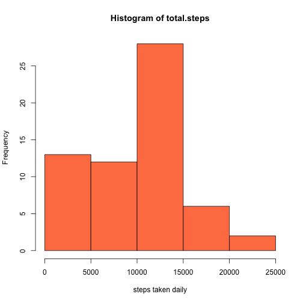
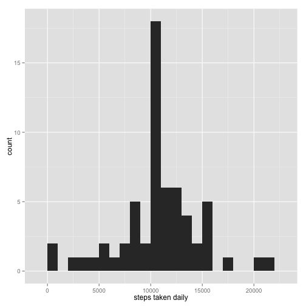
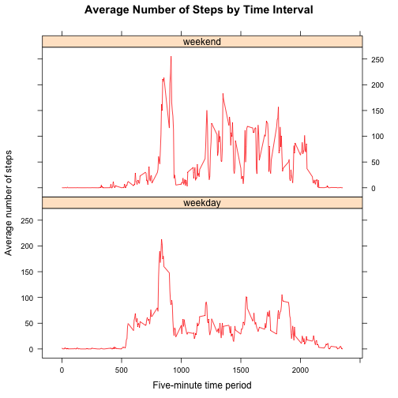

<!-- rmarkdown v1 -->

## Preparing and loading the data

```r
if(!file.exists('activity.csv')){
unzip(zipfile="activity.zip", overwrite=T)
}
dat <- read.csv("activity.csv")
```
Now we have the data ready to work with

## Which is the mean total number of steps taken per day?

```r
library(ggplot2)
total.steps <- tapply(dat$steps, dat$date, FUN=sum, na.rm=T)
hist(total.steps, xlab="steps taken daily",col="coral")
```

 

```r
mean(total.steps, na.rm=TRUE)
```

```
## [1] 9354.23
```

```r
median(total.steps, na.rm=TRUE)
```

```
## [1] 10395
```
The requested values are shown above

## What is the average daily activity pattern?

```r
library(ggplot2)
averages <- aggregate(x=list(steps=dat$steps), by=list(interval=dat$interval),
                      FUN=mean, na.rm=TRUE)
ggplot(dat=averages, aes(x=interval, y=steps)) +
    geom_line() +
    xlab("5-minute interval") +
    ylab("average number of steps taken")
```

 
Here is the resulting plot

## Imputing missing values

```r
missing <- is.na(dat$steps)
# Use the table function to show how many missing
table(missing)
```

```
## missing
## FALSE  TRUE 
## 15264  2304
```

```r
# Replace each missing value with the mean value of its 5-minute interval
fill.value <- function(steps, interval) {
    filled <- NA
    if (!is.na(steps))
        filled <- c(steps)
    else
        filled <- (averages[averages$interval==interval, "steps"])
    return(filled)
}
filled.data <- dat
filled.data$steps <- mapply(fill.value, filled.data$steps, filled.data$interval)
total.steps <- tapply(filled.data$steps, filled.data$date, FUN=sum)
qplot(total.steps, binwidth=1000, xlab="steps taken daily")
```

 

```r
mean(total.steps)
```

```
## [1] 10766.19
```

```r
median(total.steps)
```

```
## [1] 10766.19
```
Here is how the numbers change

## Are there differences in activity patterns between weekdays and weekends?

```r
library("lattice")
weekend_log <- grepl("^[Ss]", weekdays(as.Date(filled.data$date)))

for (i in (1:nrow(filled.data))) {
    if (weekend_log[i] == TRUE) {
        filled.data$day_of_week[i] <- "weekend"
    } else {
        filled.data$day_of_week[i] <- "weekday"
    }
}

mean_stps_per_intvl_imput <- aggregate(filled.data$steps, by = list(filled.data$interval, 
    filled.data$day_of_week), FUN = "mean", na.rm = TRUE)
colnames(mean_stps_per_intvl_imput) <- c("interval", "weekday_weekend", "avg_steps")

sort_order <- order(as.numeric(mean_stps_per_intvl_imput$interval))
mean_stps_per_intvl_imput <- mean_stps_per_intvl_imput[sort_order, ]

mean_by_day_type <- aggregate(filled.data$steps, by = list(filled.data$day_of_week), 
    FUN = "mean", na.rm = TRUE)
mean_weekdays <- round(mean_by_day_type[1, 2], 2)
mean_weekends <- round(mean_by_day_type[2, 2], 2)

avg_steps<-mean(total.steps)
xyplot(avg_steps ~ as.numeric(interval) | as.factor(weekday_weekend), data = mean_stps_per_intvl_imput, 
    type = "l", layout = c(1, 2), col = c("red"), main = "Average Number of Steps by Time Interval", 
    xlab = "Five-minute time period", ylab = "Average number of steps")
```

 
Final plot
